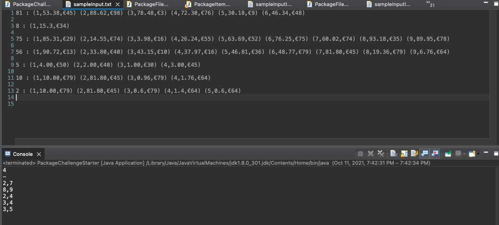

# Package Challenge 

## Problem Description


You want to send your friend a package with different items. You can choose from a number of `N` items. The items are numbered from 1 to `N`. Each one of these items has a given weight and a given cost (in €), where the weights and costs of the items might be different. The package itself has a weight limit. The combined weight of the items you put in the package must not exceed the weight limit of the package, otherwise the package would be too heavy.

Your goal is to determine which items to put in the package so that the total cost of the items you put inside is as large as possible. In case the total cost the of the packaged items is the same for two sets of items, you should prefer the combination of items which has a lower total weight.

## Constraints


1. The maximum weight that a package can hold must be <= 100.

2. There may be up to 15 items you can to choose from.

3. The maximum weight of an item should be <= 100.

4. The maximum cost of an item should be <= €100.


## Program Specification


Write a program, preferably in Java, which can be run on the command line in order to solve this problem. The program should take one command line argument, which contains the path to a text file. This text file should contain several lines, each line describing one test case for the problem.


Each line starts with the maximum weight of the package for this test case. It is followed by ` : ` and then the list of descriptions of the items available for packaging. Each item description contains, in parentheses, the item's number, starting at 1, its weight and its cost (preceded by a € sign).


In case of a constraint violation, your program should indicate this fact to the user, for example by throwing an exception with a descriptive message, allowing the user to address this problem.


### Sample Input


A sample input file looks like this:


```

81 : (1,53.38,€45) (2,88.62,€98) (3,78.48,€3) (4,72.30,€76) (5,30.18,€9) (6,46.34,€48)

8 : (1,15.3,€34)

75 : (1,85.31,€29) (2,14.55,€74) (3,3.98,€16) (4,26.24,€55) (5,63.69,€52) (6,76.25,€75) (7,60.02,€74) (8,93.18,€35) (9,89.95,€78)

56 : (1,90.72,€13) (2,33.80,€40) (3,43.15,€10) (4,37.97,€16) (5,46.81,€36) (6,48.77,€79) (7,81.80,€45) (8,19.36,€79) (9,6.76,€64)

```


### Sample Output


The solution for each test case should be printed out on a single line. On this line you should list the item numbers of the individual items to be put in the package to solve the problem. The numbers should be separated by commas. If no combination of items matches the requirements, the output should be a single `-`.


The sample output for the sample input file above should look like this:


```

4

-

2,7

8,9

```

## Overall approach and Algorithm

The appoach used to solve the problem is divided into 2 phases:
  1. Parse the given file to validated the file and its data. It follows a all or none method for process, i.e., if an invalid data is encountered for any of the rows to be          processed then none of the processing rows will be processed further.
  2. Process the data obtained from the file using the algorithm discussed below.


The algorithm used for solving the Package challenge is a typical 0/1 knapsack problem. The algorithm itself is divided into 2 parts:
  1. 0/1 Knapsack problem to find the optimal solution of maximized cost.
  2. Use the solution from above to backtrack to find the indexes used to reach the solution.

## Design pattern and coding practice

Taking the SOLID design practice into account while designing this project , utilising Singleton as one of primary design patterns into account for various services.

## Cloning the project 

Use the below command to clone the projects under Java Projects folder, import PackageChallenge project into your respective workspace to start processing 

git clone https://github.com/poojahosabettu/Java-Projects.git

## Processing 

You can run your file processing by running this project on configuration by configuring the necessary file path for processing.

The processing begins from the PackageChallengeStarter.java file, which take one command line paramneter which will be read as filename for package processing.

java PackageChallengeStarter "{Write your file name here}"

## Tech Stack

The below tech stack are used for building the project 
  1. Maven
  2. Eclipse
  3. Java 8
  4. JUnit (For Test coverage)

## Build and test

Run the below command for maven build and run test files

mvn clean install

## Sample Output




